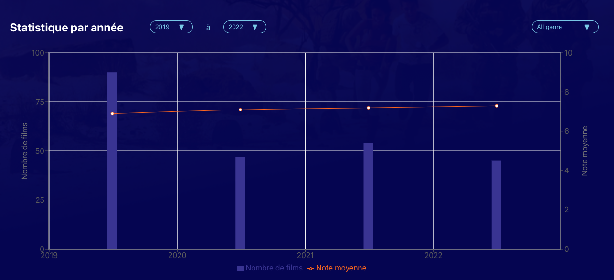

## :newspaper: News App

> This is an app that you can find the latest movies. You can also search a movie.
> Demo link : [here](https://emiri-i.github.io/movie-finder/)

## :camera: Screen Shots





## :computer: Technologies Used

[](https://skillicons.dev)

## :star: Features

List the ready features here:

- You can find the latest movie.
- You can search the latest movie by typing keyword.
- You can see a movie detail.

## :wrench: Setup

1. Clone this repository

```bash
$ git clone https://github.com/Emiri-i/movie-finder.git
```

2. Go into the repository

```bash
$ cd news-app
```

3. Install dependencies

```bash
$ npm install
```

4. Run the app

```bash
$ npm run start
```

## :bulb: Room for Improvement

- My rating function. Currently there is no function to rate the movie.
- Registering the favorite movies.
- Responsive UI.

## :blue_book: License

[MIT](https://choosealicense.com/licenses/mit/)
